<h1 align="center">Hi 👋, I'm Edílson Paulo Chivinge</h1>

<h3 align="center">Full Stack Developer | Java & Spring Boot | React</h3>

  
  

---

## 👨‍💻 About Me

I'm a **Computer Engineering student from Mozambique 🇲🇿** focused on building modern, secure and scalable software solutions.

My main focus is **backend development with Java and Spring Boot**, while also working with **React** to build complete full-stack applications.

I enjoy turning real-world problems into software, especially projects involving APIs, databases, automation, integrations and scalable system architecture.

* 🔭 Building **full-stack and backend applications**
* ☕ Focused on **Java & Spring Boot**
* ⚛️ Building modern interfaces with **React & Tailwind CSS**
* 🗄️ Working with **PostgreSQL, MySQL and relational databases**
* 🐳 Exploring **Docker, cloud infrastructure and scalable architectures**
* 🔐 Interested in **API security, authentication and backend architecture**
* 🚀 Always learning by building real-world projects

---

## 🛠️ Tech Stack

### Backend

  
  &nbsp;
  
  &nbsp;
  

### Frontend

  
  &nbsp;
  
  &nbsp;
  
  &nbsp;
  
  &nbsp;
  

### Databases & Tools

  
  &nbsp;
  
  &nbsp;
  
  &nbsp;
  
  &nbsp;
  
  &nbsp;
  

---

## 🚀 Featured Projects

### 📡 MegaSaaS — Automated Internet Package Sales

A multi-tenant SaaS platform designed to automate the sale and delivery of mobile internet packages.

**Highlights:**

* WhatsApp integration
* M-Pesa payment validation
* Android SMS/USSD automation
* Multi-tenant architecture
* Idempotent payment processing
* REST APIs and internal service communication

**Tech:** `Java 21` `Spring Boot` `Node.js` `PostgreSQL` `REST APIs`

🔗 [View Repository](https://github.com/Edilson1233/TxunaMegas)

---

### 💳 Wallet Management

A mobile-first digital wallet interface focused on modern financial application UX.

**Features:**

* Authentication screens
* Digital wallet dashboard
* Transfer flow
* Transaction review
* PIN security interface
* Reusable UI components

**Tech:** `React` `Vite` `Tailwind CSS` `React Router` `JavaScript`

🔗 [View Repository](https://github.com/Edilson1233/wallet-management)

---

### 🌍 BePrepared — Disaster Alert System

Backend application designed to help users stay informed during natural disasters through alerts and location-based information.

**Tech:** `Java` `Spring Boot` `REST API` `Docker`

🔗 [View Repository](https://github.com/Edilson1233/beprepared)

---

## 📊 GitHub Statistics

  
  

---

## 🤝 Connect With Me

---

  <i>Building, learning and turning ideas into software. 🚀</i>

